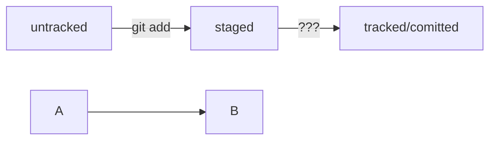

# Шпаргалка markdown

## Выделение текста

Вы можете выделять текст в markdown с помощью символов `_` или `*`. Например:

Пример _курсива_ и **жирного** текста.

## Заголовки

Заголовки можно создавать с помощью символа `#`. Чем больше `#`, тем меньше заголовок. Например:

# Заголовок первого уровня
## Заголовок второго уровня
### Заголовок третьего уровня

## Выделение кода

Чтобы выделить текст как код, поместите его в тройные кавычки `````. 

```
mkdir my_project
cd my_project
git init
```
## Хеш

•	Git преобразует информацию о коммитах с помощью алгоритма SHA-1 и для каждого из них рассчитывает уникальный идентификатор — хеш.

•	Хеш — основной идентификатор коммита и позволяет узнать его автора, дату и содержимое закоммиченных файлов.

•	Все хеши, а также таблицу соответствий хеш → информация о коммите Git хранит в папке .git.


## Лог - описание коммита

### Структура лога:
•	строка из цифр и латинских букв после слова commit — это хеш коммита;
•	Author — имя автора и его электронная почта;

•	Date — дата и время создания коммита;

•	в конце находится сообщение коммита.

Получить сокращённый лог можно с помощью команды 
```
git log  --oneline
```
## Файл HEAD 

- один из служебных файлов папки .git. Он указывает на коммит, который сделан последним:

Если нужно передать последний коммит, то вместо его хеша можно просто написать слово HEAD 
 
 ## формат описания схем Mermaid.


Блоки кода в маркдауне начинаются и заканчиваются тремя символами 

```. После первых трёх ``` 
можно указать, какой именно код будет внутри блока.

 Например: ```mermaid , ```bash, ```python, ```javascript и так далее.
 
  Если ничего не указать, GitHub будет считать весь код простым текстом.

