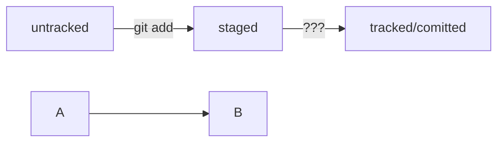

# Шпаргалка GIT

•	Чтобы вывести текущую рабочую директорию, можно использовать команду pwd.

•	Чтобы перейти к домашней директории используют команду cd ~.

•	изменить директорию -  cd;

•	вывести содержимое директорий  -  ls;

•	просматреть содержимое вместе со скрытыми файлами и папками  ls -a.

•	Команда touch создаёт файл, а команда mkdir — директорию.

•	С помощью флага -p можно создать целую структуру директорий одной командой: mkdir -p.

•	Для копирования файлов используют команду cp, для перемещения — mv

•	Вывести содержимое файла можно командой cat.

•	Для удаления файла используют rm, для удаления пустой директории — rmdir, а для директории с файлами — rm -r.

•	Все команды удаления стирают данные безвозвратно — их нельзя будет восстановить из корзины!

•	С помощью && можно выполнить несколько команд сразу — одну за другой.

•	Команды, которые вы выполняете в консоли, попадают в историю. Вы можете перемещаться по этой истории при помощи стрелок ↑↓.

•	При нажатии на Tab консоль предложит несколько вариантов продолжения команды.

•	Символами / и ~ можно быстро перемещаться к корневой и домашней директориям.

•	Инициализировать репозиторий можно с помощью команды git init.

•	Проверить статус, или состояние, репозитория поможет команда git status.

•	Если вы ошиблись и случайно инициализировали не ту папку, можно «разгитить» её — удалить скрытую подпапку .git.

•	Команда git add позволяет подготовить файл к сохранению.

•	Команда git add --all подготовит к сохранению сразу все файлы.

•	С помощью git add . можно добавить в репозиторий текущую папку со всеми файлами.

•	Коммит можно сделать с помощью команды git commit.

•	Ключ -m позволяет присвоить коммиту сообщение. Помните, что такие сообщения должны быть информативными: чётко описывать изменения.

•	В коммит попадает то, что было предварительно добавлено «в корзину», или «в кадр», перед коммитом.

•	Коммиты хранятся в ветках. Начальная ветка создаётся автоматически и называется main или master.

•	За отправку изменений на удалённый репозиторий отвечает команда git push.


# Шпаргалка markdown

## Выделение текста

Вы можете выделять текст в markdown с помощью символов `_` или `*`. Например:

Пример _курсива_ и **жирного** текста.

## Заголовки

Заголовки можно создавать с помощью символа `#`. Чем больше `#`, тем меньше заголовок. Например:

# Заголовок первого уровня
## Заголовок второго уровня
### Заголовок третьего уровня

## Выделение кода

Чтобы выделить текст как код, поместите его в тройные кавычки `````. 

```
mkdir my_project
cd my_project
git init
```
## Хеш

•	Git преобразует информацию о коммитах с помощью алгоритма SHA-1 и для каждого из них рассчитывает уникальный идентификатор — хеш.

•	Хеш — основной идентификатор коммита и позволяет узнать его автора, дату и содержимое закоммиченных файлов.

•	Все хеши, а также таблицу соответствий хеш → информация о коммите Git хранит в папке .git.


## Лог - описание коммита

### Структура лога:
•	строка из цифр и латинских букв после слова commit — это хеш коммита;
•	Author — имя автора и его электронная почта;

•	Date — дата и время создания коммита;

•	в конце находится сообщение коммита.

Получить сокращённый лог можно с помощью команды 
```
git log  --oneline
```
## Файл HEAD 

- один из служебных файлов папки .git. Он указывает на коммит, который сделан последним:

Если нужно передать последний коммит, то вместо его хеша можно просто написать слово HEAD 
 
 ## формат описания схем Mermaid.


Блоки кода в маркдауне начинаются и заканчиваются тремя символами 

```. После первых трёх ``` 
можно указать, какой именно код будет внутри блока.

 Например: ```mermaid , ```bash, ```python, ```javascript и так далее.
 
  Если ничего не указать, GitHub будет считать весь код простым текстом.

